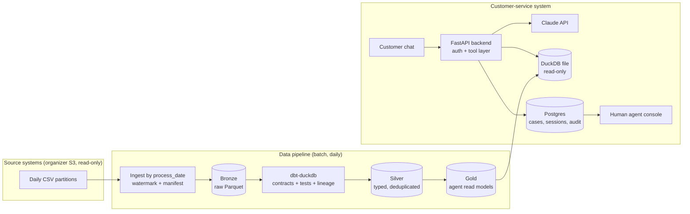

# Architecture

We simulate how a real bank would run an AI-first customer-service workflow, on a hackathon budget. Every component below has two columns: what we run for the hackathon (≈ $0 infrastructure) and what we would use in production. The hackathon choice always plays the same **role** as the production one, so the design and its contracts carry over; only the scale, availability and compliance guarantees change.

> Status: proposal. The customer-service workflow (disputes, card support, credit info, …) is not chosen yet; it decides which tables the agent needs.

## Simulated banking process

The supplied data is static, but a bank receives it as **daily batches from its source systems** (core banking, contact center, digital channels). We reproduce that:

- The pipeline ingests **one `process_date` partition at a time**, tracking a watermark of processed days, exactly like a nightly batch.
- Loads are **idempotent**: re-running a day produces the same result.
- A labeled **test fixture** replays a late-arriving and a corrected partition to prove update correctness (the brief asks for this when only static data is supplied).

## Components

| Component | Hackathon (≈ $0) | In a real bank we would use | Role it simulates |
|---|---|---|---|
| Ingestion | Python script downloads one daily partition from the organizer S3; manifest of processed files | CDC from core banking (Debezium / AWS DMS) into Kafka | Daily delivery from source systems |
| Orchestration | `make pipeline` + scheduled GitHub Actions | Airflow (MWAA) or Dagster | Nightly batch scheduling |
| Lake storage | Parquet in a team-owned bucket (S3 free tier or Cloudflare R2) | S3 + Iceberg/Delta with Glue or Unity Catalog | Bronze / silver / gold landing zones |
| Transformation & quality | dbt-duckdb: model contracts, tests, `dbt docs` lineage; checks from `quality.py` become dbt tests | dbt on Databricks/Snowflake + Monte Carlo / OpenLineage | Data contracts, quality gates, lineage |
| Agent read data | Read-only DuckDB file shipped inside the API container | Aurora Postgres read replica or the core-banking API | Balance and transaction lookups |
| Agent write data | Managed Postgres free tier (Supabase or Neon): sessions, cases, disputes, handoffs, audit log | Aurora Postgres with Row-Level Security and replicas | Case management (PQR) system |
| Banking tools | Mock FastAPI tools (`get_transactions`, `open_dispute`, …) that check permissions on every call | Internal APIs behind an API gateway with mTLS | Core banking services |
| Identity | Signed JWT test sessions for seeded test users + simulated OTP | Bank IdP (OIDC: Okta/Keycloak) with step-up MFA | Customer authentication |
| LLM | Claude API: Haiku 4.5 for classification/routing, Sonnet 5 only where needed; hard spend cap | Same models through a private endpoint (e.g. Bedrock) with data residency and zero retention | Conversational engine |
| Policy retrieval (RAG) | pgvector in the same Postgres, over clearly labeled synthetic policies | OpenSearch or a managed vector store | Knowledge base |
| Tracing & audit | Langfuse free tier or OpenTelemetry | Self-hosted Langfuse / Datadog + SIEM | Observability and audit trail |
| Human handoff | Streamlit console reading the handoff queue from Postgres | Salesforce Service Cloud / Zendesk / Genesys | Escalation to a human agent |
| Secrets | GitHub Actions secrets and local `.env` | AWS Secrets Manager or Vault, with KMS | Credential management |
| Deployment | Render, Fly.io or Railway | ECS/EKS inside a private VPC | Production hosting |

## Key decisions

**Split reads from writes.** Free Postgres tiers are around 0.5 GB, while `transactions` alone is ~1 GB in Postgres. Large read-only data therefore lives in a DuckDB file inside the API container (no size limit, no cost), and Postgres only holds what the agent writes, which is small. Access control is enforced in the tool layer on every call, which is what the brief asks for ("enforce access to each customer's records and action permissions in the service or tool layer").

**DuckDB for the pipeline, not as a multi-user database.** Measured on the full dataset (M-series Mac, local Parquet):

| Query | DuckDB | pandas |
|---|---|---|
| USD amount by country and month (4.4M rows) | 88 ms | 1,206 ms |
| Transactions × customers by segment | 82 ms | — |
| `digital_events` by type (15.6M rows) | 12 ms | — |
| Last 20 transactions of one customer, from Parquet | 119 ms | 274 ms |
| Same, from a DuckDB table | 6 ms | — |
| One month of CSV read directly from the organizer S3 | 18.5 s | — |

Reading CSV from S3 is the slow path, so it happens once (bronze). DuckDB is embedded and single-process, so it serves read models only; concurrent writes and per-customer isolation belong to Postgres.

**Do not depend on the organizer bucket at runtime.** Its credentials are read-only and may be revoked after the event, while judging runs until Oct 16. The deployed system reads only from team-owned storage.

**Cost is the LLM, not the infrastructure.** Infrastructure stays on free tiers; LLM spend is capped at the API-key level and reported per attempted case and per successful resolution, as the evaluation requires.

## Risks and open items

- **Free-tier databases may pause after inactivity.** The demo must answer until Oct 16: confirm the chosen provider's current policy or add a scheduled keep-alive.
- **Free-tier limits change often.** The limits above are approximate; verify them when provisioning.
- **Data quality issues found in `notebooks/validate_vs_dictionary.ipynb`** (Spanish enum values, broken branch FKs, `process_date` cutting at 06:00, NPS without promoters) must be handled in silver and reported as data limitations.
- **Portuguese is required** by the brief but the dataset is Spanish-only: this is a language-coverage limitation to report.
