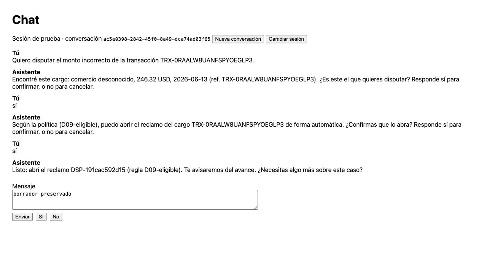

# Integrated smoke preparation and diagnostic evidence

No provider calls were made. **The live-model L2 gate remains open.** The host and existing API
container had no configured model credential. The initial total paid allowance is USD 1, allocated
by the runbook to baseline/corrected/browser runs rather than silently spending USD 1 per process.

The new runner accepts real extraction with explicit prices, preflight estimate, conservative
per-call reservations, no SDK retries, and a trial timeout. It records failing requests and model
calls, preserves error reservations, and rejects unmatched/incomplete comparisons. Budget/timeout
negative controls passed. `docs/integrated_smoke.md` gives the executable sequence.

## Recorded diagnostics

| Workload | Result | Evidence |
|---|---|---|
| Matched isolated API, scripted extraction, ten dev cases × one trial | Baseline **6/10** (95% Wilson 31.3–83.2%) → corrected **10/10** (72.2–100%); errors **0/10** each | `2026-10-02-harness-matched-evidence.json`, `2026-10-02-harness-comparison.json` |
| Gold-bound real PostgreSQL stores, scripted extraction, eight dev cases × one trial | **8/8**, 95% Wilson **67.6–100%**; errors **0/8** | `2026-10-02-postgres-scripted-evidence.json` |
| Corrected #23 browser → diagnostic gateway → real API/PostgreSQL | Thirteen named manual checks observed; no automatic TrialGrade or statistical rate claimed | `2026-10-02-browser-scripted-evidence.json`, screenshot below |

The matched baseline imports unmodified backend/prompts from `2213a31`; its old legitimate customer
header is used on policy scenarios, while auth/expired scenarios still require rejection. Both runs
use the same corrected harness, data, scripts and grades. Imported backend and runtime prompt files
are hashed separately from the harness checkout SHA. Four baseline failures are unauthorized legacy
identity, expired identity, lost clarification filters, and replay after a transient policy error.
This comparison validates the diagnostic and corrections; it is not model-performance evidence.

The PostgreSQL workload reads existing gold rows and verifies their labels against current policy.
It covers D01, D07, D09, both D06 block choices, foreign transaction denial, legacy identity denial
and expired bearer denial. No bank tables or the running shared stack were changed. Case writes
remain in memory; individual automatic trials use fresh app/case state.

The browser uses frontend commit `75073eb` and the corrected backend via a separate loopback gateway.
Observed checks: D09 verified opening; preserved draft on Sí; conversation reset; credential clearing;
expired bearer rejection; D07 verified handoff without write/block; one accepted initial request from a
double-click; D06 refusal creates a handoff with no block; D06 acceptance blocks only the owned card;
foreign transaction denial; ambiguous request asks for more details without an action; injected policy
failure recovers; restart loses the prior dispute. These are named manual observations, not thirteen
independent eval trials or a pass-rate estimate.

The initial browser process records fourteen HTTP requests (thirteen HTTP 200 and one HTTP 401).
The refusal snapshot is preserved before accepting a block on the same gold product, so later state
cannot obscure the negative control. It contains no block; the later snapshot contains one owned block
and three verified handoffs. The foreign read is audited `denied/not_owner`. The double-click yields
exactly one accepted initial D07 request. A new diagnostic process injects a one-time policy error;
HTTP results are **200, 502, 200, 200**, and the UI recovers with a single verified dispute opening.
The snapshot before that new write has no prior dispute: restart lost it. This confirms the documented
persistence limitation, not durability. Test credentials/headers are excluded from published evidence.
The initial snapshot's internal default status/empty grade is ungraded; later snapshots explicitly
identify manual grading.

## Verification and limits

Full local `make ci`: **205 Python tests**, lint/format/types, case validation, three API regressions,
ten-case offline smoke and frontend types. Corrected #23 production frontend build also passed.

Small selected draft workloads and one trial do not establish generalization or pass^k for k>1.
Safety grading remains partial (ownership, confirmation and verified actions); grounding, injection
and language checks are not implemented. Portuguese remains pending. The gateway excludes Caddy/TLS.
Live extraction and the Caddy/TLS/deployed-stack smoke remain open. Disputes/handoffs/audit are not PostgreSQL-persistent. The previous PR25 nine-case
report remains the evidence for that earlier run; the new expired-bearer case increases this workload
to ten and is not presented as a matched nine-case improvement.
