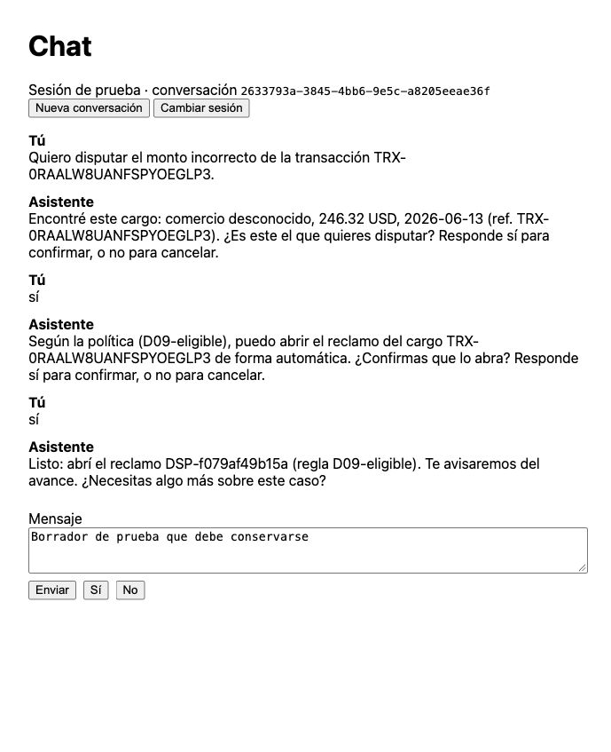

# Local browser / PostgreSQL / live model smoke

The corrected #23 UI, corrected #24 API and #25 diagnostic gateway were exercised in the native
browser against actual PostgreSQL gold records and live `gpt-6-luna` extraction. This was a local
loopback diagnostic, not the Caddy/TLS or deployed demo path. PostgreSQL `bank.*` remained read-only;
disputes, card blocks, handoffs and conversations were process-local mock-bank state.

The [matched L2 run](2026-10-02-live-l2.md) separately passed 36/36 trials (95% Wilson 90.4–100%)
against a baseline with only amount-schema compatibility at 21/36. These browser observations
are manual checks, not independent trials or an automatically graded success rate.

| Check | Observed evidence |
|---|---|
| D09 resolution | Found gold transaction TRX-0RAALW8UANFSPYOEGLP3; confirmed transaction and action; displayed DSP-f079af49b15a, matching stored dispute and audited read-back |
| Unsent draft | The draft remained after both Sí confirmations |
| New conversation | Cleared conversation id, messages and draft |
| Change session | Cleared credential and prior conversation; password form was empty |
| Expired session | HTTP 401; no model call or tool invocation for the rejected request |
| D07 above limit | HO-88b41a577735 existed with D07-above-auto-limit; no dispute or block for this case |
| Other customer's transaction | `get_transaction` denied access; reply disclosed no foreign transaction details and performed no write |
| D06 reject block | Explicit No produced HO-76006f4351b8; snapshot showed no card block |
| D06 accept block | A separate conversation asked for explicit Sí; one owned-product block and HO-f0563ad1f271 were read back |
| Ambiguous request | Asked for merchant, amount or date and performed no new action |
| Double click | Exactly one accepted request for “Quiero disputar un cargo.” |
| Tool error / retry | Separate fresh gateway: HTTP 200 → 502 → 200 → 200, visible error and retry recovery, exactly one successful open_dispute write; displayed/stored DSP-8ba4ed2db0fb |

The gateway restart created fresh case state; the same D09 bank transaction received a different
dispute reference after the restart. This demonstrates the documented process-local persistence
limitation, not successful durability. The earlier no-block snapshot was captured before the later
block check because both cases select the same gold product.

Evidence: [main browser requests, model calls, audit and final state](2026-10-02-browser-live-evidence.json),
[no-block snapshot](2026-10-02-browser-no-block-evidence.json),
[fault/retry evidence](2026-10-02-browser-live-fault-evidence.json),
and [spend ledger for all paid attempts](2026-10-02-live-budget-ledger.json).
Credentials were ephemeral, stored separately with mode 0600, excluded from evidence and removed
on shutdown. Temporary gateways, UI server and browser tab were stopped; the user's API on 8000
was left running.

Across L2 attempts and both browser checks, reported token usage prices total **USD 0.0124252**.
Conservative reservations, including failed calls with unavailable usage, total **USD 0.2085836**,
below the authorized USD 1. Rates come from the
[official GPT-6 Luna model page](https://developers.openai.com/api/docs/models/gpt-6-luna);
these are usage-priced estimates, not an invoice. No SDK retries were enabled.

The merged #25 checkout's backend source hash exactly matches the corrected paid L2 source.
`make ci` passed on #24 (184 Python tests), #23 (184 Python tests + 2 frontend API tests),
and #25 (219 Python tests, 12/12 scripted dev smoke, 4/4 API regressions, schema checks,
lint/format/types and frontend types). No additional paid run was needed for the identical backend.

Remaining gates: Caddy/TLS and deployed origin, Portuguese, full grounding/language/injection
graders, held-out evaluation, durable case/conversation storage, OTel traces and production identity.
This closes the local dev smoke with a live model; it does not close those production requirements.

